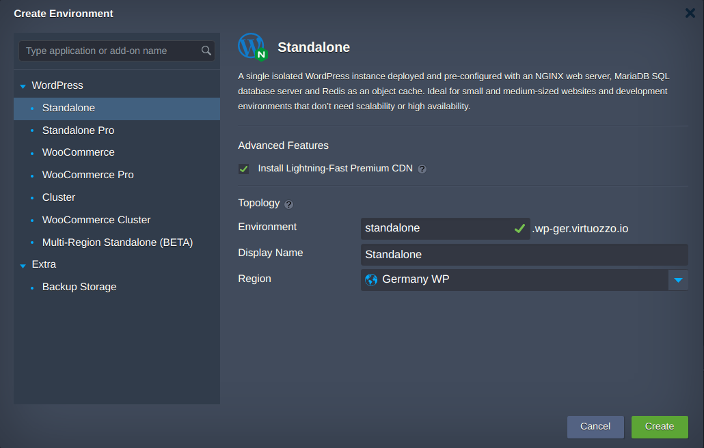
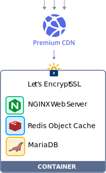
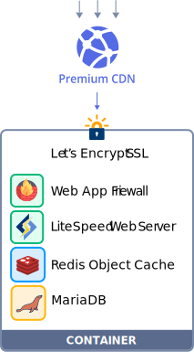
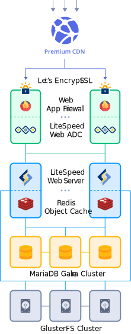

 

 
## WordPress Edition
This repository houses a collection of WordPress solutions to build websites of any flavour within [Virtuozzo Application Platform for WordPress](https://docs.jelastic.com/virtuozzo-application-platform-for-wordpress/).
 

 

 
 
The platform is a DevOps platform dedicated to WordPress hosting specifically. It offers a number of prepackaged topologies of varying complexity (from single-container solutions to clusters and synchronized multi-region instances), which covers all the range of use cases (from small testing installation to the enterprise-level clusters).

### Standalone
A single isolated WordPress instance deployed and pre-configured with an NGINX web server, MariaDB SQL database server and Redis as an object cache. Ideal for small and medium-sized websites and development environments that don’t need scalability or high availability.

 

### Standalone Pro
Same as the Standalone package, but using the commercial edition of the LiteSpeed Web Server instead of NGINX. Also includes seamless integration with the LiteSpeed WordPress Plugin for better quality, resource utilization and performance.

 

### WooCommerce
Same as the Standalone package, but with a pre-installed and optimized WooCommerce plugin. Ideal for smaller e-commerce businesses that don't need to serve hundreds or thousands of concurrent shopping cart users, or deal with unexpected load-spikes.

### WooCommerce Pro
A fusion of the Standalone Pro and the WooCommerce packages. Designed for smaller e-commerce businesses, but delivering better page load times and a better user experience, via the seamless integration of WooCommerce and LiteSpeed.

### Cluster
A WordPress cluster deployed and pre-configured with an optimized software stack, including a LiteSpeed web server, MariaDB SQL database server (SQL replication or Galera cluster), Redis as an object cache, and an NFS or GlusterFS cluster as the distributed filesystem volume. Ideal for projects that require high availability, scalability and unmatched quality and performance for a superior end-user experience.

 

### WooCommerce Cluster
A fusion of the Cluster and WooCommerce packages. Ideal for eCommerce businesses that need to serve hundreds or thousands of concurrent users and handle any load spike. With WooCommerce Cluster you can run campaigns without worrying about downtime or slow performance damaging your reputation and brand.
